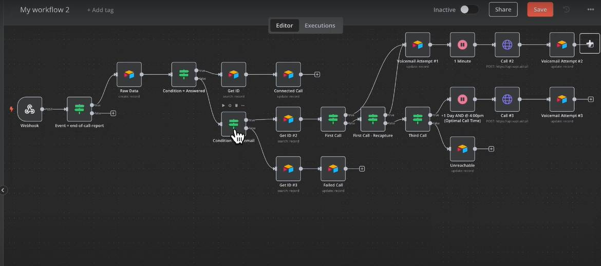

# Conversational AI Sales Agent 

This project is a fully functional Conversational AI Sales Agent built using GPT-4 and LangChain. It is designed to interact with customers, answer queries, recommend products, and follow up on leads. The agent integrates seamlessly with websites, CRMs, and messaging platforms.

## Features

- Natural, human-like conversations with customers
- Product recommendations based on customer intent
- Lead qualification and follow-up automation
- Integration with CRMs, websites, and messaging apps
- Retrieval-Augmented Generation (RAG) for context-aware responses
- Prompt engineering for optimized performance
- Built using Python, GPT-4, and LangChain

## Tech Stack

- **LLM**: OpenAI GPT-4
- **Framework**: LangChain
- **Language**: Python
- **Memory/Context**: Vector Store (e.g., FAISS, Pinecone)
- **Integrations**: CRM APIs, Website Chat Widgets, Messaging APIs
- **Deployment**: Docker, REST APIs

## Capabilities

- Handle sales FAQs and product queries
- Dynamically retrieve product information via RAG
- Maintain session memory for personalized conversations
- Automatically log and update CRM lead status

##  Completed Tasks

-  Trained and fine-tuned prompt templates
-  Integrated with a live CRM system
-  Deployed via API for easy frontend integration
-  Tested across multiple customer interaction scenarios

##  Contact

For more info or collaboration inquiries, please reach out via [your email] or connect on [LinkedIn/GitHub].
